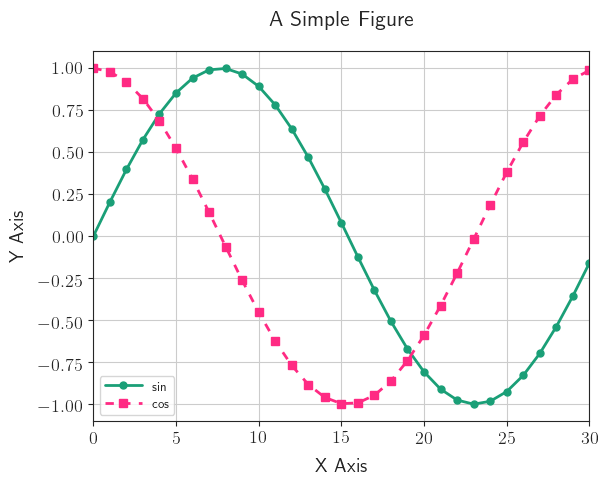

# json2plot

python 3 Matplotlib plotting from json files containing appropriate data. 

Uses Seaborn for prettier plots. 

see `python3 json2plot.py -h` for more information. 


## Demo

I.e. 

```bash
    ./json2plot.py demo/demo.json -o demo/demo.png 
```


